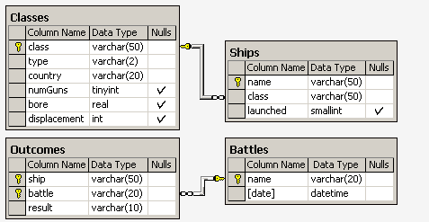
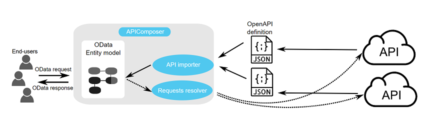

<h1>Пример реализации паттерна API Composer.</h1>

Структура БД имеет следующий вид:



Корабли в «классах» построены по одному и тому же проекту, и классу присваивается либо имя первого корабля, 
построенного по данному проекту, либо названию класса дается имя проекта, которое не совпадает ни с одним 
из кораблей в БД. Корабль, давший название классу, называется головным.

Отношение Classes содержит имя класса, тип (bb для боевого (линейного) корабля или bc для боевого крейсера), страну, в которой построен корабль, число главных орудий, калибр орудий (диаметр ствола орудия в дюймах) и водоизмещение ( вес в тоннах). В отношении Ships записаны название корабля, имя его класса и год спуска на воду. В отношение Battles включены название и дата битвы, в которой участвовали корабли, а в отношении Outcomes – результат участия данного корабля в битве (потоплен-sunk, поврежден - damaged или невредим - OK).
Замечания. 
1) В отношение Outcomes могут входить корабли, отсутствующие в отношении Ships. 
2) Потопленный корабль в последующих битвах участия не принимает.


Задача:
---
Для всех непотопленных кораблей из базы определить количество битв, в которых они участвовали.
Вывести название корабля, количество битв.

<h3>Решение через SQL</h3>

```sql
with all_ships as (
select c.class, s.name ship from classes c, ships s
where c.class = s.class
union
select o.ship class, o.ship from outcomes o
where o.ship not in (select name from ships)
),
ships_total as (
select all_ships.ship, battle, result from all_ships
left join outcomes o on all_ships.ship = o.ship)
select ship, count(battle) from ships_total where ship not in
(select ship from ships_total where result = 'sunk')
group by ship

```


Для реализации паттерна будем считать, что каждый микросервис отвечает за управление
одной таблицей. Итого, выделим 4 микросервиса:

1) battles
2) classes
3) outcomes
4) ships

<h2>Структура каждого микросервиса</h2>

1) Пакет `contracts`, который содержит контракты для эндпоинтов
2) Пакет `extensions`, содержащий код для подключения к БД
3) Миграции `alembic`
4) Пакет с моделями `SQLAlchemy`
5) Пакет с провайдерами, предоставляющие CRUD операции над сущностями. (для задачи реализовано только READ)


Концепция:
---


Создать API Composer, который будет собирать и обрабатывать данные из других сервисов
через обращение к данным по API. Каждый микросервис предоставляет OpenAPI схему на основе которой генерируется
http клиент. Клиенты получают уведомление об изменении в микросервисе и на основе новой OpenAPI схемы генерируется новый
клиент.

<h1>Установка</h1>

1) Установить зависимости из requirements.txt
2) Запустить сервисы из compositor.docker-compose.environment.full.yml
3) Запустить каждый сервис: uvicorn main:app --reload --port <ваш порт>

---
!!! При запуске сервиса миграций могут быть проблемы. Иногда он запускается раньше, чем Postgres сообщает о готовности
работы с запросами. Сначала запустите Postgres и после его готовности запустите миграции
